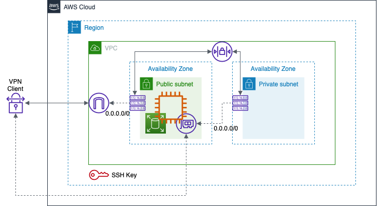

<!-- This should be the location of the title of the repository, normally the short name -->
# tf-aws-landing-zone - Terraform script to deploy a lite landing
# zone on AWS along with an EC2 instance

<!-- Build Status, is a great thing to have at the top of your repository, it shows that you take your CI/CD as first class citizens -->
<!-- [](https://travis-ci.org/jjasghar/ibm-cloud-cli) -->

<!-- Not always needed, but a scope helps the user understand in a short sentance like below, why this repo exists -->
## Scope

The purpose of this repository is to provide example code to demonstrate how components of a Virtual Private Cloud a.k.a. Landing Zone can be deployed using Terraform on Amazon Web Services (AWS). Terraform provides a common infrastructure-as-code provisioning methodology across multiple providers (AWS, Azure, GCP, IBM) and can be integrated with other configuration management infrastructure-as-code platforms like Ansible.

This repository when run will deploy the infrastructure as depicted in the diagram. The configuration of the EC2 Instance to operate as a VPN and NAT server is done through Ansible, which is not in the scope of this respository.


<!-- A more detailed Usage or detailed explaination of the repository here -->
## Usage

Update the key variables in terraform.tfvars file and execute terraform as described in (Execution) below.


Key files:

- terraform.tfvars: User provided variable (see configuration below)
- provider.tf: Terraform variable declaration, called as var.* in other files
- ec2.tf: EC2 instance, deploys instance in subnet, attaches public IP, attaches storage
ami.tf: Amazom Machine Image(s) for use in EC2 instance

Execution:

To deploy the infrastructure components

- `terraform init`
- `terraform plan -out="instance.plan"`
- `terraform apply "instance.plan"`

To remove the infrastructure

- `terraform plan -destroy -out="instance.destroy.plan"`
- `terraform apply "instance.destroy.plan"`

Configurations:

The deployment requires the following details:

- Classless Inter Domain Routing (CIDR) address space for the VPC
- CIDR for a Public Subnet from the VPC CIDR
- CIDR for a Private Subnet from the VPC CIDR
- OpenVPN Port and Protocol numbers for configuring the Network Access Control List (NACL) and Security Group
- Host name to allocate to the Instance

Additionally, ec2.tf can be configured to use the appropriate Amazon Machine Images (AMI) as configured in ami.tf

terraform.tfvars: Provides the user entries for the above details

provider.tf: Provides terraform with placeholders for variables that can be provided through terraform.tfvars or through Ansible

Cleaning up:

No clean up is required post running the script(s).

<!-- License and Authors is optional here, but gives you the ability to highlight who is involed in the project -->
## License & Authors

If you would like to see the detailed LICENSE click [here](LICENSE).

- Author: Sayan A Ghosh <sayan.acharya.ghosh@kyndryl.com>
- Maintainer: Sayan A Ghosh <sayan.acharya.ghosh@kyndryl.com>

```text
Copyright:: 2022-2022 Kyndryl, Inc

Licensed under the Apache License, Version 2.0 (the "License");
you may not use this file except in compliance with the License.
You may obtain a copy of the License at

http://www.apache.org/licenses/LICENSE-2.0

Unless required by applicable law or agreed to in writing, software
distributed under the License is distributed on an "AS IS" BASIS,
WITHOUT WARRANTIES OR CONDITIONS OF ANY KIND, either express or implied.
See the License for the specific language governing permissions and
limitations under the License.
```
